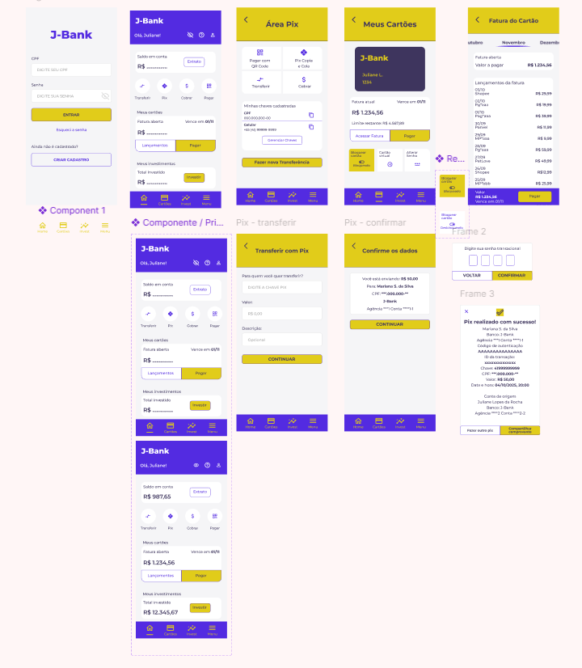
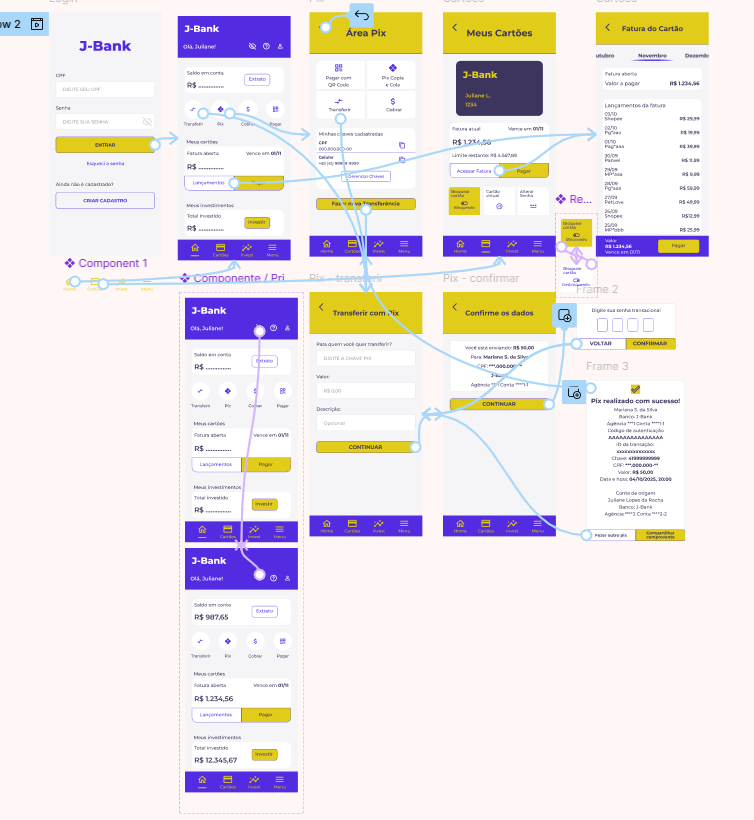

# 🏦 J-Bank

Protótipo interativo de alta fidelidade de um aplicativo bancário, desenvolvido no **Figma** como projeto acadêmico da disciplina de **Design de Interação** do curso de Análise e Desenvolvimento de Sistemas.

O projeto explora a construção de interfaces e fluxos de navegação para operações bancárias, com foco em **transferência via Pix** e **consulta e pagamento da fatura do cartão**.

## 🎯 Objetivo

O objetivo do projeto foi aplicar conceitos de Design de Interação na criação de uma experiência bancária digital, organizando diferentes telas e estados da interface em fluxos de navegação compreensíveis para a pessoa usuária.

A proposta envolveu não apenas a criação visual das telas, mas também a configuração das interações entre elas para produzir um protótipo navegável.

## ✨ Principais fluxos

### 💸 Transferência via Pix

O fluxo de transferência permite percorrer diferentes etapas da operação:

1. acesso à conta;
2. entrada na Área Pix;
3. escolha da opção de transferência;
4. preenchimento da chave Pix e valor;
5. conferência dos dados;
6. confirmação da operação;
7. visualização do comprovante.

### 💳 Cartão e fatura

O protótipo também apresenta um fluxo relacionado ao cartão:

1. acesso aos cartões;
2. visualização da fatura;
3. consulta dos lançamentos;
4. acesso à opção de pagamento da fatura.

## 🎨 Interface e interação

Durante a construção do protótipo, foram trabalhados elementos como:

- consistência visual entre as telas;
- hierarquia das informações;
- componentes reutilizados na interface;
- diferentes estados da aplicação;
- navegação inferior;
- feedback após ações;
- organização de fluxos de usuário;
- conexões entre frames para simular a navegação do aplicativo.

## 📸 Telas do protótipo

Visão geral das interfaces desenvolvidas:

## 🔗 Fluxo interativo

As telas foram conectadas no Figma para simular a navegação entre as diferentes etapas das operações.

## 🛠️ Ferramentas e conceitos

- Figma
- UI/UX
- Design de Interação
- Prototipação de alta fidelidade
- Protótipo interativo
- Componentes
- Fluxos de usuário
- Navegação entre telas

## 🔗 Protótipo no Figma

[Acessar protótipo interativo no Figma](https://www.figma.com/design/jLacjEoblEuMKmdC5hcqeK/J-Bank?node-id=0-1&t=hjtwMmhGDl89i55u-1)

> Os nomes, valores, documentos e demais informações bancárias apresentados nas telas são **dados fictícios**, utilizados exclusivamente para fins de prototipação e demonstração.

## 📚 O que pratiquei

O desenvolvimento do J-Bank permitiu praticar a transformação de funcionalidades em fluxos de interação, considerando como a pessoa usuária percorre diferentes etapas até concluir uma operação.

Também pratiquei a criação e reutilização de componentes, organização visual das informações, definição de estados da interface e construção de um protótipo navegável no Figma.

## 📌 Contexto

Projeto acadêmico desenvolvido na disciplina de **Design de Interação**, durante o curso de Análise e Desenvolvimento de Sistemas.

O protótipo foi criado para fins de aprendizagem e não representa uma aplicação bancária real.
